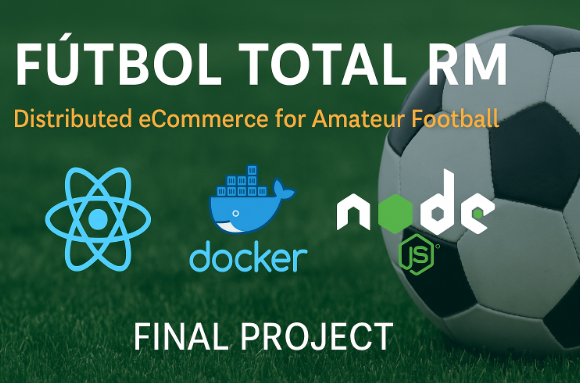

# ⚽ Fútbol Total RM – Quito Edition

> Distributed e-commerce platform focused on **amateur football in Quito, Ecuador**, built using a **resilient, scalable microservices architecture**, fully containerized with Docker, automated with CI/CD, and deployed to AWS EC2.

> 🎓 Final project – Distributed Programming Course – Universidad Central del Ecuador

---

 <!-- Optional: place your own banner image in /docs -->

---

## 🚀 Main Features

- 🧩 10 independent backend microservices
- 🐍 Python (Flask) & 🟩 Node.js (Express) used in backend
- 🖥️ Frontend built with React + Vite + Tailwind CSS
- ☁️ AWS EC2 deployment with Elastic IPs
- 🐳 Full Docker & Docker Compose integration
- 🔐 JWT-based security and Role management
- 🔄 NGINX API Gateway with service routing
- ⚙️ GitHub Actions + Docker Hub for CI/CD automation
- 🧭 Clean Architecture + MVC + Event-Driven integration

---

## 🧱 Tech Stack

| Layer            | Technologies                                                  |
|------------------|---------------------------------------------------------------|
| Frontend         | React, Vite, Tailwind CSS                                     |
| Backend          | Flask (Python), Express (Node.js)                             |
| API Gateway      | NGINX                                                         |
| Databases        | MySQL (3 logical databases: users, products, orders)          |
| Containerization | Docker, Docker Compose                                        |
| DevOps / CI/CD   | GitHub Actions, Docker Hub                                    |
| Infrastructure   | AWS EC2 + Elastic IP                                          |
| Security         | JWT, CORS, Role-based Access                                  |
| Observability    | Prometheus, Grafana (optional in QA)                          |

---

## 📂 Project Structure

```bash
futbol-total/
├── apps/
│   ├── web/                      # Web frontend (React)
│   ├── api-gateway/             # NGINX config
│   ├── user-create-service/
│   ├── user-read-service/
│   ├── user-update-service/
│   ├── user-delete-service/
│   ├── user-password-recovery/
│   ├── user-role-service/
│   ├── product-catalog-service/
│   ├── inventory-service/
│   ├── order-placement-service/
│   └── cart-service/
├── qa-lacala/                   # Docker Compose setup for QA deployment
├── docs/                        # Diagrams, documentation, reports, images
└── .github/workflows/           # GitHub Actions pipelines
```

---

## 🔧 How to Run (Local QA Environment)

```bash
git clone https://github.com/rommela462/futbol-total.git
cd futbol-total/qa-lacala
docker compose -f qa-services.yml up -d
```

- Access frontend via: `http://localhost` or EC2 Elastic IP

---

## 🧩 Implemented Microservices

| Domain     | Microservice               | Language | Main Route                                |
|------------|----------------------------|----------|--------------------------------------------|
| Users      | Create                     | Python   | POST `/users/create`                       |
|            | Read                       | Python   | GET `/users/read/<id>`                     |
|            | Update                     | Python   | PUT `/users/update/<id>`                   |
|            | Delete                     | Python   | DELETE `/users/delete/<id>`                |
|            | Password Recovery          | Python   | POST `/users/password-recovery`            |
|            | Role Management            | Python   | POST `/users/roles`                        |
| Products   | Product Catalog            | Python   | GET `/products/list/<id>`                  |
|            | Inventory                  | Python   | GET `/inventory/list/<id>`                 |
| Orders     | Order Placement            | Node.js  | POST `/create`, GET `/list/:user_id`       |
| Cart       | Shopping Cart              | Python   | POST `/cart/add`, GET `/cart/get/<id>`     |

---

## 🌐 Live Deployment (QA)

- Frontend: `http://<your-frontend-elastic-ip>`
- Gateway/API: `http://<your-api-gateway-ip>/products/list/1`
- Swagger: Available on each microservice at `/docs`

---

## 📊 Architecture & Diagrams

All project diagrams are located in the [`docs/`](docs/) folder:

- 🧠 System Architecture (High-level)
- 🔁 Use Case Diagram
- 🧩 Microservices Interaction Flow
- 📦 Database Schema (Users, Products, Orders, Cart)
- 🔐 User State Diagram
- 🎥 Demo (optional .gif or video)

---

## 🛠️ DevOps & Automation

- 🔁 **CI/CD**: Automated using GitHub Actions
- 🐳 **Docker Hub**: [rommela462](https://hub.docker.com/u/rommela462)
- ☁️ **Auto Deployment** to AWS EC2 via SSH + Docker Compose
- 🛠️ `qa` branch used for staging environment

---

## 📑 Documentation

- 📝 Swagger: Each microservice exposes docs via `/docs`
- 📄 Final report: `docs/informe-final.pdf`
- 📊 Presentation: `docs/presentacion.pdf`
- 🧠 Backend services follow MVC + Clean Architecture
- ✅ Unit testing in each service using Pytest / Jest

---

## 👤 Author

**Rommel Pachacama**  
Universidad Central del Ecuador  
Final Project – Distributed Programming 2025  
📧 pachacamarommel@gmail.com

---

## 📜 License

This project is licensed under the **MIT License** – feel free to use for academic purposes.


# EcommerceMicroservices

<a alt="Nx logo" href="https://nx.dev" target="_blank" rel="noreferrer"></a>

✨ Your new, shiny [Nx workspace](https://nx.dev) is almost ready ✨.

[Learn more about this workspace setup and its capabilities](https://nx.dev/nx-api/node?utm_source=nx_project&amp;utm_medium=readme&amp;utm_campaign=nx_projects) or run `npx nx graph` to visually explore what was created. Now, let's get you up to speed!

## Finish your CI setup

[Click here to finish setting up your workspace!](https://cloud.nx.app/connect/0t1Sbuflkx)


## Run tasks

To run the dev server for your app, use:

```sh
npx nx serve user-create
```

To create a production bundle:

```sh
npx nx build user-create
```

To see all available targets to run for a project, run:

```sh
npx nx show project user-create
```

These targets are either [inferred automatically](https://nx.dev/concepts/inferred-tasks?utm_source=nx_project&utm_medium=readme&utm_campaign=nx_projects) or defined in the `project.json` or `package.json` files.

[More about running tasks in the docs &raquo;](https://nx.dev/features/run-tasks?utm_source=nx_project&utm_medium=readme&utm_campaign=nx_projects)

## Add new projects

While you could add new projects to your workspace manually, you might want to leverage [Nx plugins](https://nx.dev/concepts/nx-plugins?utm_source=nx_project&utm_medium=readme&utm_campaign=nx_projects) and their [code generation](https://nx.dev/features/generate-code?utm_source=nx_project&utm_medium=readme&utm_campaign=nx_projects) feature.

Use the plugin's generator to create new projects.

To generate a new application, use:

```sh
npx nx g @nx/node:app demo
```

To generate a new library, use:

```sh
npx nx g @nx/node:lib mylib
```

You can use `npx nx list` to get a list of installed plugins. Then, run `npx nx list <plugin-name>` to learn about more specific capabilities of a particular plugin. Alternatively, [install Nx Console](https://nx.dev/getting-started/editor-setup?utm_source=nx_project&utm_medium=readme&utm_campaign=nx_projects) to browse plugins and generators in your IDE.

[Learn more about Nx plugins &raquo;](https://nx.dev/concepts/nx-plugins?utm_source=nx_project&utm_medium=readme&utm_campaign=nx_projects) | [Browse the plugin registry &raquo;](https://nx.dev/plugin-registry?utm_source=nx_project&utm_medium=readme&utm_campaign=nx_projects)


[Learn more about Nx on CI](https://nx.dev/ci/intro/ci-with-nx#ready-get-started-with-your-provider?utm_source=nx_project&utm_medium=readme&utm_campaign=nx_projects)

## Install Nx Console

Nx Console is an editor extension that enriches your developer experience. It lets you run tasks, generate code, and improves code autocompletion in your IDE. It is available for VSCode and IntelliJ.

[Install Nx Console &raquo;](https://nx.dev/getting-started/editor-setup?utm_source=nx_project&utm_medium=readme&utm_campaign=nx_projects)

## Useful links

Learn more:

- [Learn more about this workspace setup](https://nx.dev/nx-api/node?utm_source=nx_project&amp;utm_medium=readme&amp;utm_campaign=nx_projects)
- [Learn about Nx on CI](https://nx.dev/ci/intro/ci-with-nx?utm_source=nx_project&utm_medium=readme&utm_campaign=nx_projects)
- [Releasing Packages with Nx release](https://nx.dev/features/manage-releases?utm_source=nx_project&utm_medium=readme&utm_campaign=nx_projects)
- [What are Nx plugins?](https://nx.dev/concepts/nx-plugins?utm_source=nx_project&utm_medium=readme&utm_campaign=nx_projects)

And join the Nx community:
- [Discord](https://go.nx.dev/community)
- [Follow us on X](https://twitter.com/nxdevtools) or [LinkedIn](https://www.linkedin.com/company/nrwl)
- [Our Youtube channel](https://www.youtube.com/@nxdevtools)
- [Our blog](https://nx.dev/blog?utm_source=nx_project&utm_medium=readme&utm_campaign=nx_projects)
